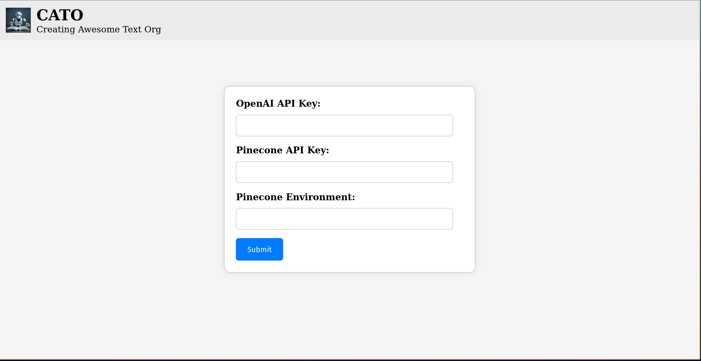
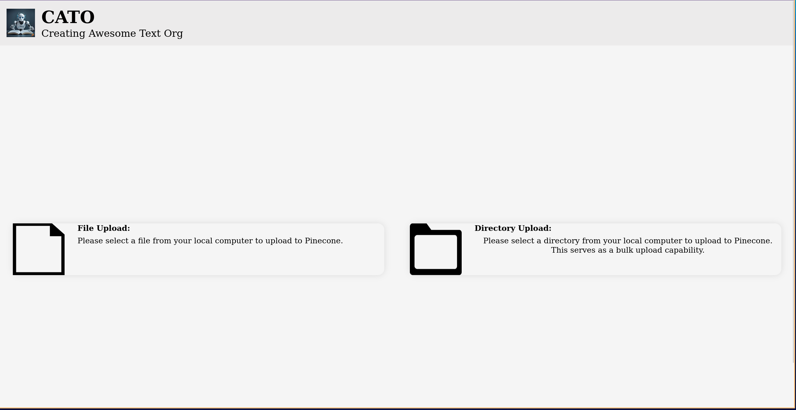
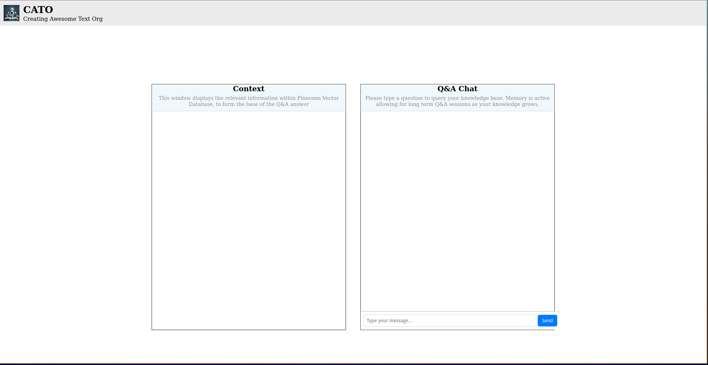
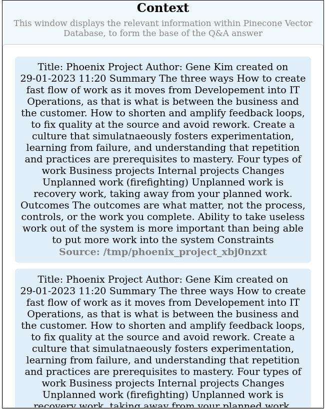
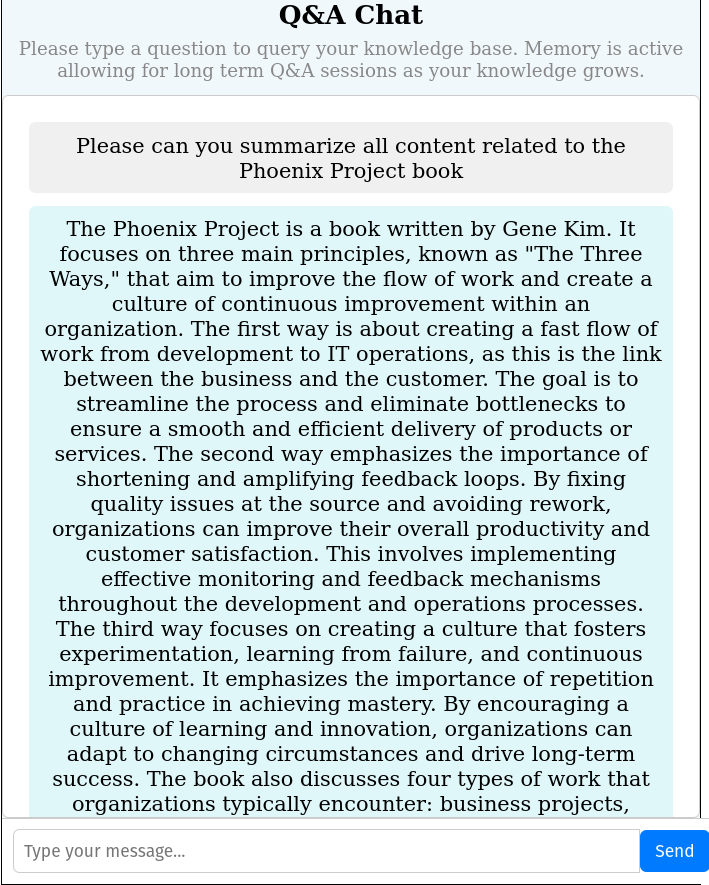

# Mimic 1
_Author mimicking using OpenAI with available local information._

## Intro
Evaluate existing AI large language models (llm's) to determine optimal parameters and use within the following contexts:
- **Recreate:** Generate document sections based on previous examples within the document knowledge base. 
- **Novel Generation:** Generate novel text based on the user query.
- **Improvements:** Based on a given selection of text, improve the text grammatically, structurally, and contextually.
- **Mimic:** Mimic tbe writing style of an author in order to reproduce text inline with an author's standards and idiosyncrasies.

## Privacy
OpenAI will come into contact with local information sources. 
OpenAI collects account information, user content, communication information, and social media interactions ([https://openai.com/policies/privacy-policy](https://openai.com/policies/privacy-policy))

However, it is **important** to note that OpenAI's models are not trained on the output or inputs to the models. 
The link stating this is as follows: [https://openai.com/api-data-privacy](https://openai.com/api-data-privacy).

## Application
An application has been developed in order to effectively query a user's document knowledge based. 
This application is open to further development based on the results of the **experimentation** to produce optimal results. 
The application can be used as follows: 

### Running It
#### Application
In order to run the application, 2 steps need to be completed: 
1. Build and Run the docker container: The docker container will install all dependencies and launch a local server where all of the functionality is located. The below commands should be used:
```
docker build -t mimic .
docker run -p 8000:8000 mimic
```
2. Open the `frontend/index.html` webpage in your web browser. If you are on PyChamr, a browser icon will appear in the top-right corner of the screen, alternatively right clicking on the file and selecting *open with* will allow you to open it in your browser. 


#### Server
In order to run the FastAPI server only, please execute the following:
```
uvicorn backend.main:app --reload
```

### Capabilities
The capabilities of the application are as follows:

#### Home Page

Please ensure that when running the application, you submit your credentials before attempting to use any other features of the 
application.


#### Credentials

Credentials require:
- An OpenAI API Key. For more information please consult: https://openai.com/
- A Pinecone Vector Database API Key. For more information please consult: https://www.pinecone.io/
  - Pinecone Environment

Please click **Submit**. Your credentials are now set as environmental variables on your local computer. 


#### Doc Upload

This feature allows for two functionalities: 
1. File Upload: Clicking the button brings up a file selection window. Within this you can select multiple individual files to upload to your Vector Database.
2. Directory Upload: Clicking the button brings up a directory selection window. This allows for the upload of an entire directory. Please be advised, this does not work with nested directories. 

The following file types are supported for upload:
- docx
- pdf
- txt
- md

**Note:** Documents you wish to upload should be placed within the `kb` directory. 
This allows you to keep better track of those already uplaoded. 

**Additionally:** Please utilize the following document naming protocol: `title-author`


#### Question and Answer
This feature allows you to hold a Q&A over your knowledge base. 

Please note the below example draws on notes taken from the book the **Phoenix Project** by Gene Kim, George Spafford, and Kevin Behr.


On the right-hand side there exists a chat-box where the user can state their query:


On the left-hand side a context window contains all context to the user's query.



A response is formulated based on the context:




#### Generative and Doc Generation
These features are currently not developed. 
The ideas behind them were as follows:
- **Generative:** A generative focused model making use of the document knowledge base to build novel arguments. 
- **Doc Generation:** This is a similar focus to the Generative, however a document outline could be specified, with the generative model fulling in novel text.

---------------------------------------------------------------------------------------------------------------------------------------
## Experimentation
Experimentation is performed to determine the optimal model and parameter arrangement for the specified use cases.
The experimentation is structured and performed within `notebooks/experimentation.ipynb`. 

### Important Experiment Notes:
- Experimentation only accepts .txt documents or documents already in your vector database (the Mimic application can be used to upload different document types). 
- It is essential that the documents uploaded follow the specified document naming convention: `title-author` (this allows for correct metadata creation)
- Addition of multiple parameters for experimentation, increases the experiment pool size exponentially. Please ensure you know the number of experiments created before running them.
- Please be aware of open-source model limitations. Often open-source models are rate or context limited, such that sets of experiments may fail due to this

### Experiment Environment
In order to give the `experimentation.ipynb` access to essential Pinecone and OpenAI API keys, the keys are set as environmental variables. 
Please perform the following steps in order to ensure your API keys are in no danger of leaking: 

1. Create a file called `credentials.py` within the `notebooks/` directory.
2. Copy and paste the below code into the file, placing your correct API keys:
```
import os


def set_credentials():
    os.environ['OPENAI_API_KEY'] = 'OPENAI API KEY'
    os.environ["PINECONE_API_KEY"] = 'PINECONE API KEY'
    os.environ["PINECONE_ENV"] = 'PINECONE ENVIRONMENT'
```
3. This file is already included in the `.gitignore` file and so will be ignored by github, thus ensuring your keys safety. 
4. The `experimentation.ipynb` already uses the `set_credentials()` function. 
5. Please ensure that this file is never added to Github. Doing this will cause an API key leak.

**Please consult experimentation.ipynb for further experiment instructions**
--------------------------------------------------------------------------------------------------------------------------------------
## Development

### Project Structure
```
kb (Knowledge Base) /
    Local information making up the knowledge base of the project
notebooks/
    Jupyter notebooks dealing with exploration and experimentation outside of the application developement
frontend/
    The directory containing the source code for the application frontend. Comprised of html, css, and javascript
backend/
    The directory containing the source code fro the application backend. Powered by FastAPI
images/
    Directory of images used in README file
```

### Environment
During the development of the initial phase of Mimic and the experimentation, a Conda virtual environment was utilized. 
The `requirements.txt` file provides all dependencies. 
Due to the majority of dependencies being installed through pip, venv is the suggested virtual environment software. 
The below steps demonstrate how to create the virtual environment and jupyter notebook kernel.

A docker container is constructed in order to simplify the running and execution of the Mimic application. 
Please note the build time for the docker container is approximately 2 minutes due to the extensive dependencies of langchain and various models.

#### Creating a Conda Virtual Environment
Please execute the following command from the terminal within the project root directory:

```
python -m venv mimic_venv
source mimic_venv/bin/activate
pip install -r requirements.txt
```

This will create the virtual environment for project use. A new direcctory called `mimic/` will appear within the project

#### Creating a Jupyter Notebook Kernel from a Conda Environment
This Kernel is required to execute the `experimentation.ipynb`. Please follow the below steps:

1. Ensure that your conda virtual environment is active.
2. Execute the following command (Please rename firstEnv to your desired name):
```
python -m ipykernel install --user --name=mimic_venv
```
3. Access your Jupyter Notebook (such as experimentation.ipynb)
4. Select kernel and select the name of your newly created kernel (mimic_venv)

**Note:** Any dependency additions made to your conda virtual environment are reflected in the Jupyter Notebook Kernel as well. 

### Future Development
The below lays out the thoughts on future development within the Mimic project: 

#### Document Generation
Document Generation is linked to the undeveloped tool within the Mimic application. The idea was to be able to specify a 
document template, and for a LLM and vector database to generate novel content that was based and linked back to previous relevant literature. 
This aspect potentially should be able to perform the writing style mimicking of which the application is named after, to enable fast production of 
quality documents within an author's style. 

#### Generative
Generative is linked to the undeveloped tool within the Mimic application. The concept is to contain a LLM oriented around novel content generation, 
such that it is capable of producing novel content, backed by information retrieved from the knowledge base. This tool is closely related to the **Document Generation** tool
explained above. 

#### Experimentation
The below ideas are related to experimentation: 

##### Chained Models
The current for of experimentation relies on a single LLM model. Langchain has the capability to chain multiple models together,
each with a specified functionality. This results in a chain of models each specified to perform a specific function. 
Experimentation should consider the application of multiple chained models for performance comparison against single model results. 

The below are links to documentation on model chaining within Langchain:
**ADD HERE** 

##### Context Refinement
The user query specifies context returned from the vector database. This context is made available to the LLM for inclusion in text generation. 
However, the form and state of the context effects the LLM text generation. This addition to the experimentation will allow for refinement of
the returned context by applying different preprocessing models to the returned context. The below link showcases the multiple forms 
of contextual refinement to be considered for experimentation.
**ADD HERE**

##### Code Applicability
This experimental variation possibility relates to comparing the performance of multiple code-oriented LLM models on an existing code base. 
This may require modification of the document naming protocol and an additional form of document embedding. 
The goal of this experiment is to determine the optimal parameters to be utilized on LLM code generation based on an existing code base. 
Please review the following documentation which will aid in its development:
**ADD HERE**

------------------------------------------------------------------------------------------------------------------------------------
## Resources
### Video Tutorials
- [Use Your Locally Stored Files To Get Response From GPT - OpenAI | Langchain | Python](https://youtu.be/NC1Ni9KS-rk?si=kFklvimKPrXVfcYy)
- [Query Your Data with GPT-4 | Embeddings, Vector Databases | Langchain JS Knowledgebase](https://youtu.be/jRnUPUTkZmU?si=Jn3xJ_QxXcsum87r)
- [Using ChatGPT with YOUR OWN Data. This is magical. (LangChain OpenAI API)](https://youtu.be/9AXP7tCI9PI?si=JHWz1gXPsrirzkx2)
- [Create Your Own ChatGPT with PDF Data in 5 Minutes (LangChain Tutorial)](https://youtu.be/au2WVVGUvc8?si=zIr2_AOj_-BUwIrL)

### Essential Links:
- https://python.langchain.com/docs/get_started/introduction.html