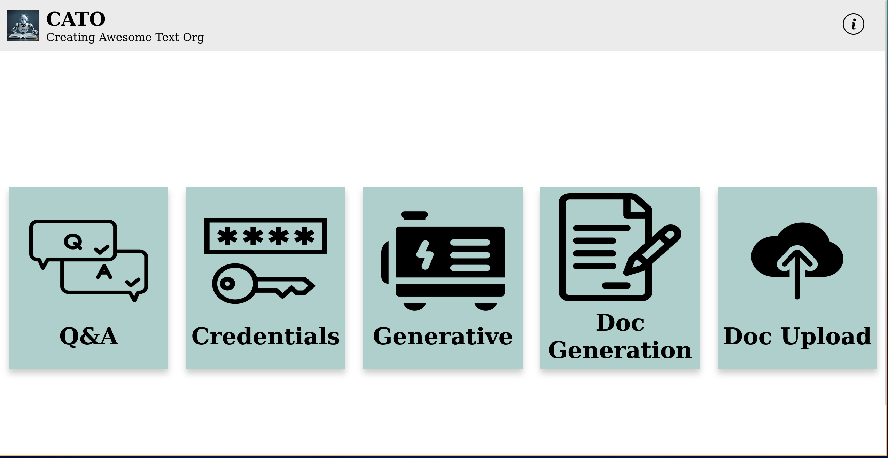

# Mimic 1
_Author mimicking using OpenAI with available local information._

## Intro
Evaluate existing AI large language models (llm's) to determine optimal parameters and use within the following contexts:
- **Recreate:** Generate document sections based on previous examples within the document knowledge base. 
- **Novel Generation:** Generate novel text based on the user query.
- **Improvements:** Based on a given selection of text, improve the text grammatically, structurally, and contextually.
- **Mimic:** Mimic tbe writing style of an author in order to reproduce text inline with an author's standards and idiosyncrasies.


## Application
An application has been developed in order to effectively query a user's document knowledge based. 
This application is open to further development based on the results of the **experimentation** to produce optimal results. 
The application can be used as follows: 

### Running It
#### Application
In order to run the application please execute the following from the project root directory (where Dockerfile is located).
This will construct a docker container, and run the container, opening the application. This will install all required dependencies
from requirements.txt, start the local server running, and open the home web-page.
```
docker build -t mimic .
docker run -p 8000:8000 mimic
```

#### Server
In order to run the FastAPI server only, please execute the following:
```
uvicorn backend.main:app --reload
```

### Capabilities
The capabilities of the application are as follows:

#### Home Page

Please ensure that when running the application, you submit your credentials before attempting to use any other features of the 
application.


#### Credentials

Credentials require:
- An OpenAI API Key. For more information please consult: https://openai.com/
- A Pinecone Vector Database API Key. For more information please consult: https://www.pinecone.io/
  - Pinecone Environment

Please click **Submit**. Your credentials are now set as environmental variables on your local computer. 


#### Doc Upload

This feature allows for two functionalities: 
1. File Upload: Clicking the button brings up a file selection window. Within this you can select multiple individual files to upload to your Vector Database.
2. Directory Upload: Clicking the button brings up a directory selection window. This allows for the upload of an entire directory. Please be advised, this does not work with nested directories. 

The following file types are supported for upload:
- docx
- pdf
- txt
- md


#### Question and Answer
This feature allows you to hold a Q&A over your knowledge base. 

Please note the below example draws on notes taken from the book the **Phoenix Project** by Gene Kim, George Spafford, and Kevin Behr.


On the right-hand side there exists a chat-box where the user can state their query:


On the left-hand side a context window contains all context to the user's query.


A response is formulated based on the context:


#### Generative and Doc Generation
These features are currently not developed. 
The ideas behind them were as follows:
- **Generative:** A generative focused model making use of the document knowledge base to build novel arguments. 
- **Doc Generation:** This is a similar focus to the Generative, however a document outline could be specified, with the generative model fulling in novel text.

---------------------------------------------------------------------------------------------------------------------------------------

## Privacy
OpenAI will come into contact with local information sources. 
OpenAI collects account information, user content, communication information, and social media interactions ([https://openai.com/policies/privacy-policy](https://openai.com/policies/privacy-policy))

However, it is **important** to note that OpenAI's models are not trained on the output or inputs to the models. 
The link stating this is as follows: [https://openai.com/api-data-privacy](https://openai.com/api-data-privacy).

## Tools
LangChain presents an optimal framework in which to work with OpenAI and its LLM models. 
[https://python.langchain.com/docs/get_started/introduction.html](https://python.langchain.com/docs/get_started/introduction.html)

## Resources 
- [Use Your Locally Stored Files To Get Response From GPT - OpenAI | Langchain | Python](https://youtu.be/NC1Ni9KS-rk?si=kFklvimKPrXVfcYy)
- [Query Your Data with GPT-4 | Embeddings, Vector Databases | Langchain JS Knowledgebase](https://youtu.be/jRnUPUTkZmU?si=Jn3xJ_QxXcsum87r)
- [Using ChatGPT with YOUR OWN Data. This is magical. (LangChain OpenAI API)](https://youtu.be/9AXP7tCI9PI?si=JHWz1gXPsrirzkx2)
- [Create Your Own ChatGPT with PDF Data in 5 Minutes (LangChain Tutorial)](https://youtu.be/au2WVVGUvc8?si=zIr2_AOj_-BUwIrL)


## Outline

### Project Structure
```
kb (Knowledge Base) /
    Local information making up the knowledge base of the project
notebooks/
    Jupyter notebooks dealing with exploration and experimentation outside of the application developement
frontend/
    The directory containing the source code for the application frontend. Comprised of html, css, and javascript
backend/
    The directory containing the source code fro the application backend. Powered by FastAPI
```

### Local Information Formats Supported
- Docx
- PDF
- txt
- md